<div align="center">

<!-- Automatic GitHub Dark/Light Theme Switching Banner -->
<picture>
  <source media="(prefers-color-scheme: dark)" srcset="https://raw.githubusercontent.com/nomaan5541/nomaan5541/main/dark.svg">
  <source media="(prefers-color-scheme: light)" srcset="https://raw.githubusercontent.com/nomaan5541/nomaan5541/main/light.svg">
  
</picture>

<br/><br/>

### ⚡ Welcome to my Digital Workspace!

```zsh
❯ nomaan5541 --whoami
[USER] Nomaan (@VIRUSBOSS)
[ROLE] Full Stack Engineer | Systems Creator | AI Innovations
[SITE] VIRUSBOSS.IN | devloper-portfolio-main.vercel.app
```

---

### 🌐 Connect & Follow Me

[](https://github.com/nomaan5541)
[](https://virusboss.in)
[](https://www.youtube.com/@VIRUSBOSS)
[](https://instagram.com/virus_boss)
[](https://devloper-portfolio-main.vercel.app/)
[](mailto:NOMAANKHANNFS2@GMAIL.COM)

</div>

---

#### 🛠️ Core Tech Stack & Tools
`React` · `Next.js` · `TypeScript` · `Node.js` · `TailwindCSS` · `Python` · `Docker` · `PostgreSQL` · `AWS` · `Git` · `Figma` · `GraphQL`
